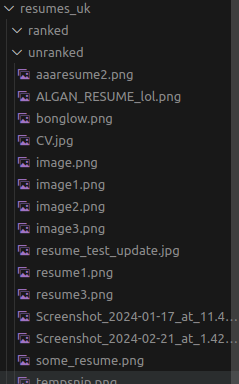
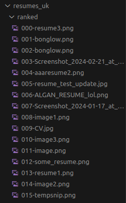

# Let Claude rank hundreds of resumes

Claude looks at images of two resumes and picks a winner. This process is repeated until a batch of resumes is ranked.

The prompt can be found in `resume_comparer.py`.

# How to use

You need to have your Anthropic API key set in your environment variables.

1. Place screenshots of resumes in `resume_default_folder/unranked`.
2. Open `resume_sorter.py` and set `RESUME_FOLDER = 'resume_default_folder'`
2. Run the python file.

# What it looks like

The resume folder should start out like this:

After the ranking process, it will look like this:

