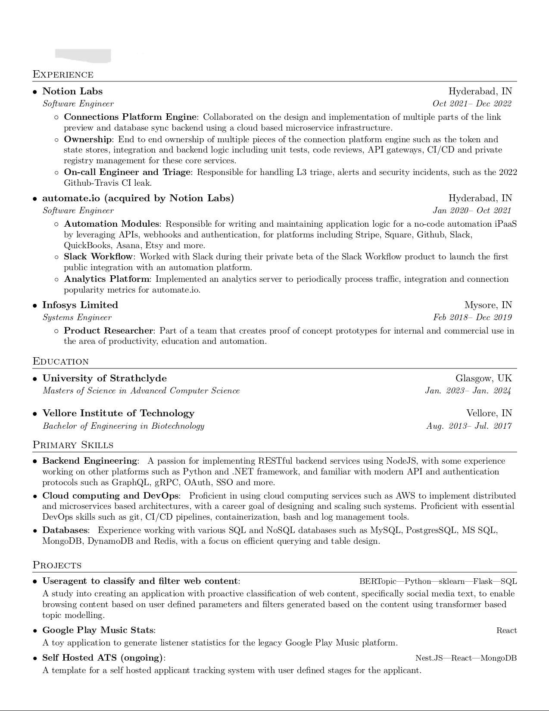
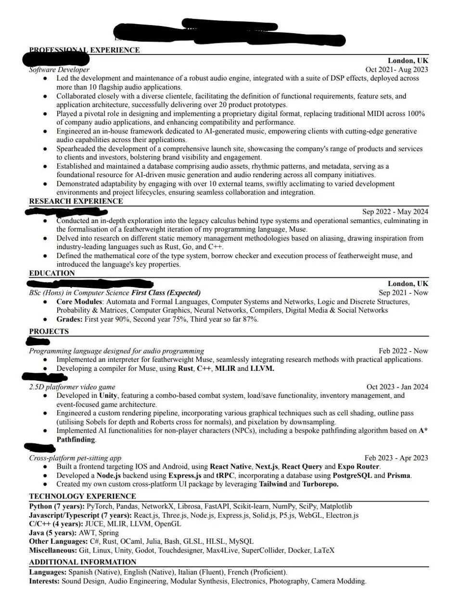

# Let Claude rank hundreds of resumes

Claude repeatedly compares two resumes until a list of resumes are sorted. Example comparison:








Claude response:

```
After carefully reviewing both resumes, I'll analyze them based on the criteria provided:

Resume A:

Strengths:
1. Relevant and recent work experience in software engineering roles
2. Experience with modern technologies and frameworks (NodeJS, AWS, CI/CD, MongoDB)
3. Diverse project experience, including web content classification and music statistics
4. Strong educational background with a Master's in Advanced Computer Science
5. Experience with both backend and cloud computing

Potential weaknesses:
1. Shorter overall work experience (about 3 years)
2. Less focus on low-level programming languages

Resume B:

Strengths:
1. Extensive experience in audio software development
2. Strong research background in programming language design
3. Diverse project portfolio including game development and cross-platform app development
4. Wide range of programming language experience (Python, C/C++, Rust, JavaScript)
5. Evidence of working on complex systems and algorithms

Potential weaknesses:
1. Less traditional software engineering experience
2. Fewer mentions of common web technologies and frameworks

Comparison based on criteria:

1. Relevance and recency of work experience:
Resume A has more recent and directly relevant software engineering experience, working with modern web technologies and cloud platforms. Resume B shows strong experience in audio software development, which is more specialized.

2. Depth and breadth of technical skills:
Both resumes demonstrate a wide range of technical skills. Resume A focuses more on web technologies, databases, and cloud computing. Resume B shows a broader range of programming languages and low-level system experience.

3. Education and academic performance:
Resume A lists a Master's degree in Advanced Computer Science, while Resume B mentions a BSc in Computer Science. Both have strong educational backgrounds, but Resume A's advanced degree might give a slight edge.

4. Project experience and relevance:
Both resumes showcase relevant projects. Resume A's projects are more web-oriented, while Resume B's projects demonstrate versatility across audio programming, game development, and cross-platform app creation.

5. Evidence of problem-solving abilities and initiative:
Both candidates show problem-solving skills. Resume A demonstrates this through work on complex systems like the Connections Platform Engine. Resume B shows initiative through the development of a programming language and various software projects.

6. Unique qualities or experiences:
Resume A has experience with automation and analytics platforms. Resume B has unique experience in audio software development and programming language design.

Alignment with early-career software engineering role:
Both candidates show strong potential for an early-career software engineering position. Resume A aligns more closely with typical web and cloud-based software engineering roles, while Resume B demonstrates a strong foundation in systems programming and diverse application development.

Weighing pros and cons:
Resume A offers more direct experience with common web technologies and cloud platforms, which are highly valued in many software engineering positions. The candidate has worked on relevant projects and has experience with modern development practices.

Resume B showcases a broader range of programming skills and experience with complex systems. This candidate demonstrates versatility and a strong theoretical foundation, which could be valuable for long-term growth and adaptability.

Conclusion:
Both candidates present strong qualifications for an early-career software engineering position. Resume A offers more immediately applicable experience with web technologies and cloud platforms, which are in high demand. The candidate's recent work experience and projects align well with many software engineering roles.

Resume B demonstrates a broader range of programming skills and experience with complex systems, which could be valuable for roles requiring lower-level programming or diverse application development. This candidate shows strong problem-solving skills and adaptability across different domains.

The choice between these candidates would depend on the specific needs of the position. If the role involves web development, cloud computing, or working with modern web frameworks, Resume A would be the better fit. If the position requires more diverse programming skills, systems-level work, or potential for working on specialized applications, Resume B might be preferable.

Given that many early-career software engineering positions involve web technologies and cloud platforms, and considering the more directly relevant recent experience:

I prefer Resume A
```

# How to use

You need to have your Anthropic API key set in your environment variables.

1. Place screenshots of resumes in `resume_default_folder/unranked`.
2. Open `resume_sorter.py` and set `RESUME_FOLDER = 'resume_default_folder'`
2. Run the python file.
